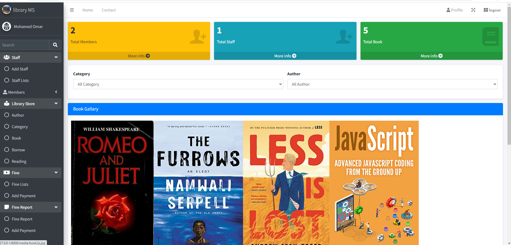
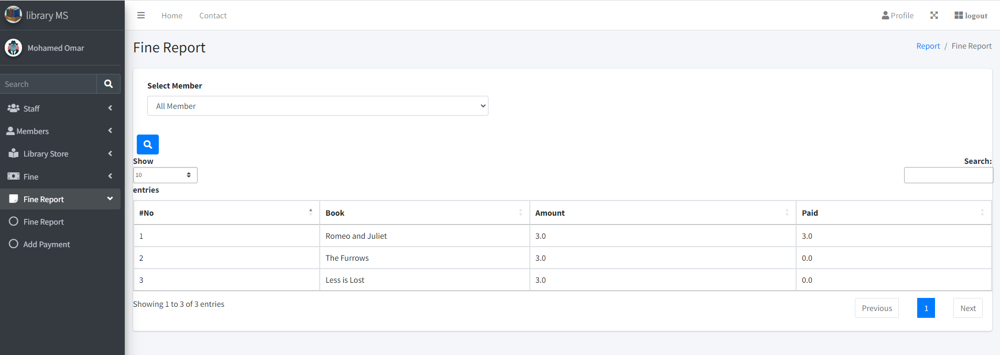
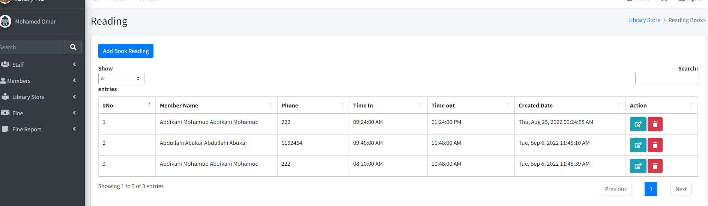
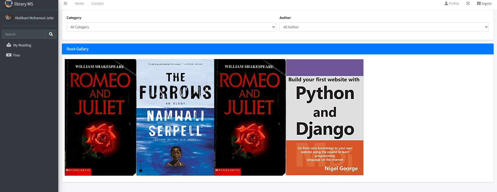
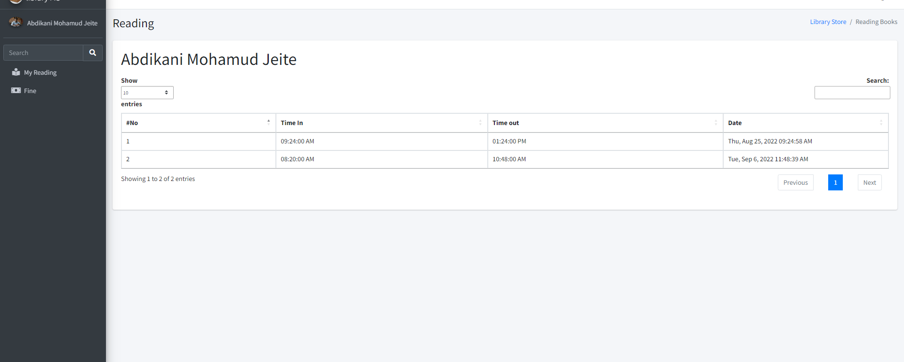

# CS50W CAPSTONE PROJECT

# Overview

A library management system is software that is designed to manage all the functions of a library. It helps librarian to maintain the database of new books and the books that are borrowed by members along with their due dates. It tracks the records of the number of books in the library, how many books are available, or how many books have been returned or late fine charges, etc.

# Structure

The web platform is structured as follows

- **apschedule:** Advanced Python Scheduler (APScheduler) is a Python library that lets you schedule your Python code to be executed later, either just once or periodically.
- **LMS:** The Library folder contains the main Django app.
- **Library:** This folder app handles the models and funtions relating to staffs and members.
- **media:** This folder are stored all images of the system.
- **statis:** This folder contains all css and js of the system.
- **Templates:** This folder handles html files.

# File Contents

## Front End:

- `static` - Holds all static files.

  - `static\bootstrap\css` - Holds all css files.
    - `static\bootstrap\css\fontawesome\` - Holds all fontawesome icons.
  - `static\bootstrap\js` - Holds some javascript files for the bootstrap.
  - `static\bootstrap\script` - Holds all javascript files that relate to the back-end of the system.
    - `static\bootstrap\script\account` - contains all files for staff and members.
      - `static\bootstrap\script\add-member.js` - javascript files that allows to add new member.
      - `static\bootstrap\script\add-staff.js` - javascript files that allows to add new staff.
      - `static\bootstrap\script\member-list.js` - javascript files that allows to view member list and also can change staff information.
      - `static\bootstrap\script\staff-list.js` - javascript files that allows to view/display staff list and also can change staff information.
    - `static\bootstrap\script\library` - contains all files for library.
      - `static\bootstrap\script\author.js` - javascript files that allows to create author or change author and display author.
      - `static\bootstrap\script\book.js` - javascript files that allows to create book or change the book and display books information.
      - `static\bootstrap\script\bookdetail.js` - javascript files that allows to view spefic book deatils.
      - `static\bootstrap\script\borrow.js` - javascript files that allows member to borrow a book.
      - `static\bootstrap\script\category.js` - javascript files that allows to create or change the category and display categories.
      - `static\bootstrap\script\dashboard.js` - javascript files that display overall view of the system such as the number of staff and members.
      - `static\bootstrap\script\fine.js` - javascript files that display member fine.if the member does not return a book then member will be fine.
      - `static\bootstrap\script\payment.js` - javascript files that allows to pay the member fine.
      - `static\bootstrap\script\reading.js` - javascript files that allows to register members that wants to read the book in the library.
    - `static\bootstrap\script\report` - contains one file for report fine.
      - `static\bootstrap\script\author.js` - javascript files that allows to members fine report such as the members that pay fee and
        those doest pay fine.

- `Templates` - Holds all template files.
  - `Templates\Base` - Holds all basic layout.
    - `Templates\Base\header.html` - Top section of page.
    - `Templates\Base\index.html` - the index file for the site - contains links to the CSS, and bootstrap javascript.
    - `Templates\Base\notfound.html` - the nofound file will be display if the user doest not have permission to access page.
    - `Templates\Base\profile.html` - contains profile information.
  - `Templates\Library Panel` - Holds all Library panel.
    - `Templates\Library Panel\Account` - Holds all Library panel.
      - `Templates\Library Panel\Account\add-member.html` - Member Registeration Form.
      - `Templates\Library Panel\Account\add-staff.html` - Staff Registeration Form.
      - `Templates\Library Panel\Account\login.html` - Login in the Library system.
      - `Templates\Library Panel\Account\member-list.html` - Displays Members Lists.
      - `Templates\Library Panel\Account\staff-list.html` - Displays Staff Lists.
        `Templates\Library Panel\Library` - Holds all Library Store.
      - `Templates\Library Panel\Library\Add-payment.html` - It allows to pay payment fine of the member.
      - `Templates\Library Panel\Library\Author.html` - It allows to manage the author.
      - `Templates\Library Panel\Library\Book.html` - It allows to manage the book.
      - `Templates\Library Panel\Library\BookDetails.html` - It allows to view the book details.
      - `Templates\Library Panel\Library\Borrow.html` - It allows to manage the book borrow.
      - `Templates\Library Panel\Library\Category.html` - It allows to manage the category of the books.
      - `Templates\Library Panel\Library\Fine.html` - It allows to display fine list.
      - `Templates\Library Panel\Library\print_bbok_borrow.html` - It allows to print book borrow informations.
      - `Templates\Library Panel\Library\print_fine.html` - It allows to print member fine informations.
      - `Templates\Library Panel\Library\Reading.html` - It allows registered members to read the books in the library.
      - `Templates\Library Panel\dash.html` - Displays staff dashboards.
      - `Templates\Library Panel\library_nav.html` - Displays the navigation bar of staff panel.
  - `Templates\Member Panel` - Holds all Member panel.
    - `Templates\Member Panel\member_dash.html` - It allows to view the spefic member to view with dashboard.
    - `Templates\Member Panel\member_fine.html` - It allows member to view fines.
    - `Templates\Member Panel\Myrading.html` - It allows member to view their reading list from start time to end time.
    - `Templates\Member Panel\nav.html` - Displays the navigation bar of member panel.
  ## Back End:

### Models in the app

There are 7 models for the web application's database.

1. `Account` - Holds information of member and staff.
2. `Author` - Holds author.
3. `Category` - Holds category.
4. `Book` - Holds the information of book.
5. `Borrow` - Holds the informations of book borrow details.
6. `Fine` - Holds fine of member book borrow.
7. `Reading` - Holds the information member readin in the library.

## Back End FILES:

- `apschedule` - Holds all time files.
  - `apschedule\functions.py` defines two functions that allow to perform spefic task.
  - `apschedule\timer.py` Here i configured APScheduler to queue background jobs.
    The directive will schedule an interval job every 5 second, starting at the time the clock process is launched.
- `Library` - Holds apps files.
  - `Library\__init__.py` makes LMS appear as a package to Python _[empty]_
  - `Library\admin.py` manages superusers _[empty]_
  - `Library\apps.py` configuration file
  - `Library\models.py` contains classes that represent tables in our database
  - `Library\urls.py` defines the mapping between URLs and views
  - `Library\views.py` returns a web response for every url path (login,index and etc )

- `LMS` - Holds directory.
  - `LMS\__init__.py` makes Python treat “finalproject” as packages _[empty]_
  - `LMS\asgi.py` supplies us an application that servers can use to communicate with the code
  - `LMS\settings.py` - used to configure Django project
  - `LMS\urls.py` - includes all the url patterns implemented in LMS directory
  - `LMS\wsgi.py` - It's commonly provided as an object named application in a Python module accessible to the server
- `.gitignore` - gitignore file tells Git which files to ignore when committing your project to the GitHub repository.
- `db.sqlite3` - database that will store all types of information
- `manage.py` - It is your tool for executing many Django-specific tasksز
- `README.md` - a writeup describing my project
- `requirements.txt` - list of Python packages that need to be installed

### How to run the application.

There are 7 models for the web application's database.
pip install -r requirements.txt
1. Ensure that you have all of the necessary Python packages (see requirements.txt) 
    ```
    pip install -r requirements.txt
    ```
2. Navigate to the location of manage.py
    
3. Run "python manage.py runserver" in the terminal with port of 8000
 ```
   py manage.py runserver
   ```

</br>

# SYSTEM IMAGES
<h2>Staff Dashboard</h2>

<h2>Book Lists</h2>

<h2>Book borrow</h2>

<h2>Fine Report</h2>

<h2>Reading Lists</h2>

<h2>Member Dashboard</h2>

<h2>Member's Reading lists</h2>
